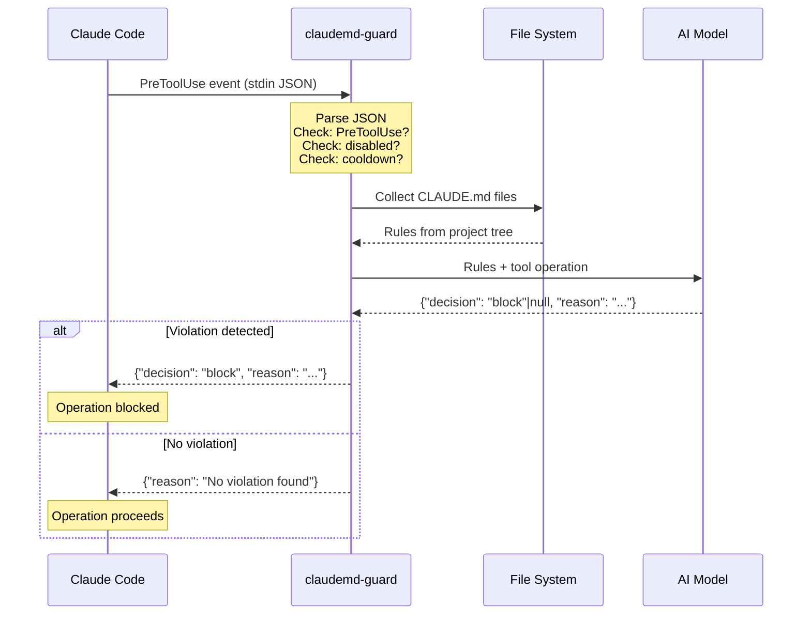
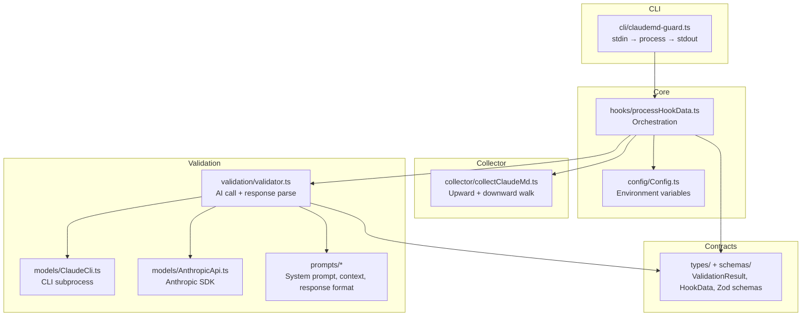
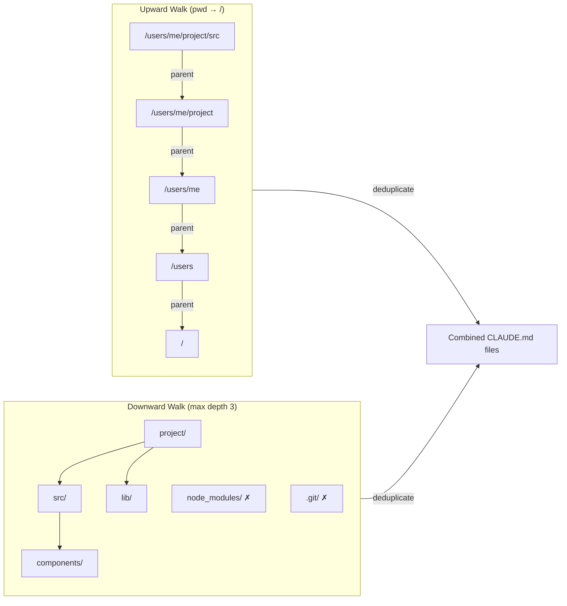
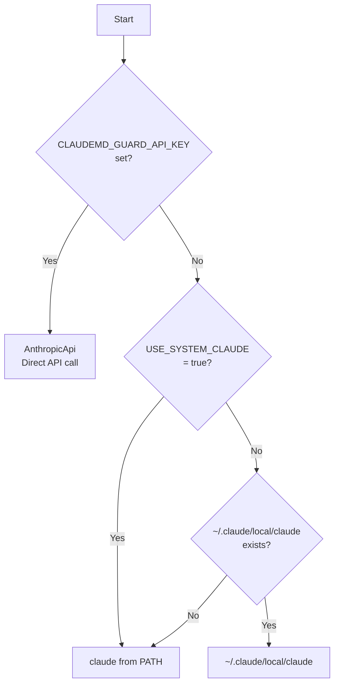
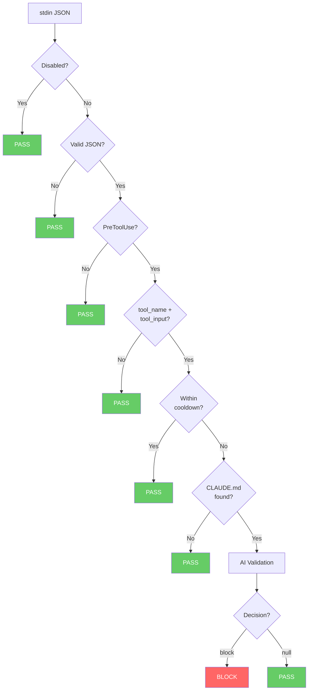

# Architecture

## Overview

claudemd-guard v2 is a TypeScript application that runs as a Claude Code PreToolUse hook.
It fires before `Edit`/`Write`/`Bash` tool execution, validates the operation against CLAUDE.md rules using AI, and blocks violations.

## Hook Flow



## Module Structure



## CLAUDE.md Collection



## Model Client Selection



## Early Exit Conditions



## Configuration

| Variable | Default | Description |
|---|---|---|
| `CLAUDEMD_GUARD_MODEL` | `claude-sonnet-4-6` | Validation model |
| `CLAUDEMD_GUARD_API_KEY` | — | Anthropic API key |
| `CLAUDEMD_GUARD_COOLDOWN` | `0` | Cooldown in seconds |
| `CLAUDEMD_GUARD_DISABLED` | `false` | Disable flag |
| `USE_SYSTEM_CLAUDE` | `false` | `true` forces PATH claude (default: ~/.claude/local/claude with PATH fallback) |

## Installation

```
~/.claude/settings.json
└── hooks.PreToolUse[]
    └── matcher: "Edit|Write|Bash"
        └── command: "node /path/to/claudemd-guard/dist/cli/claudemd-guard.js"
```
