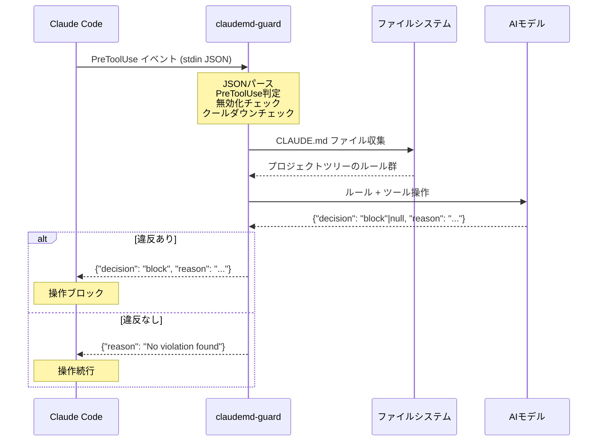
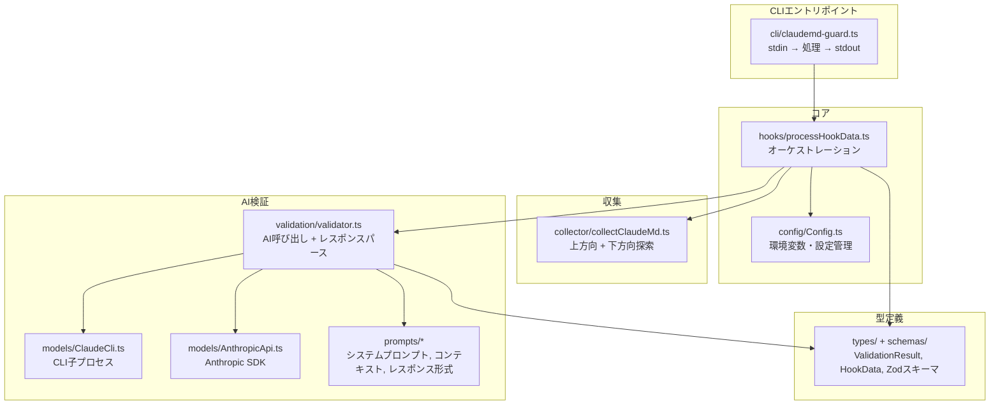
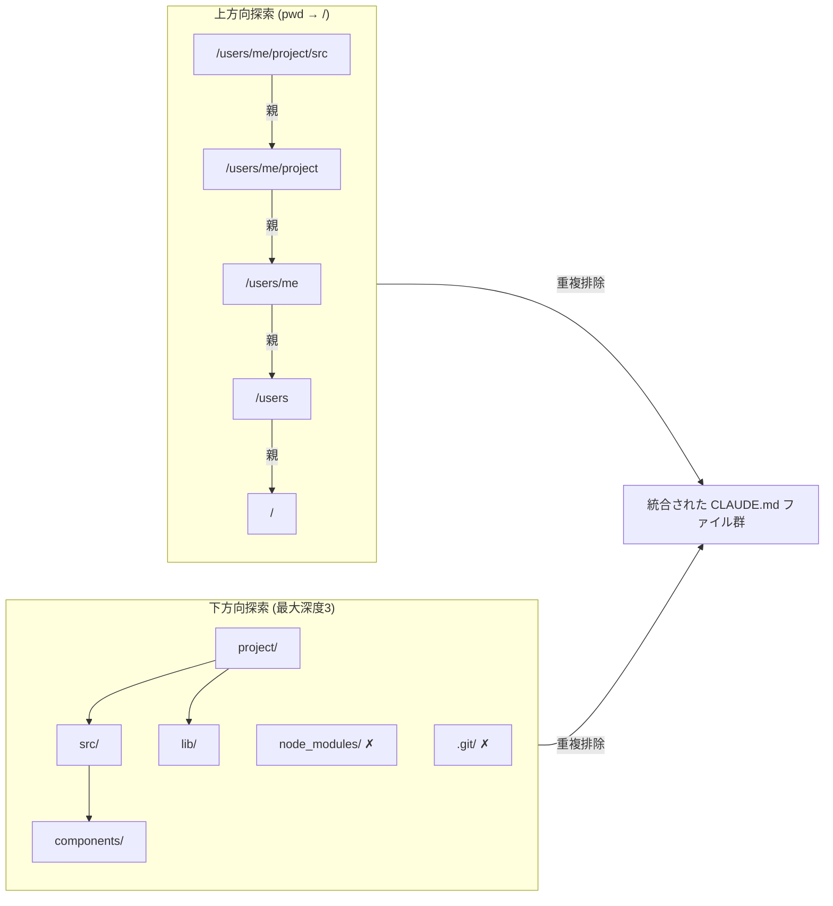
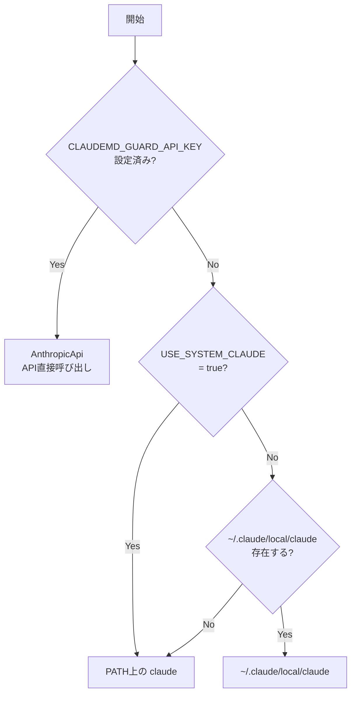
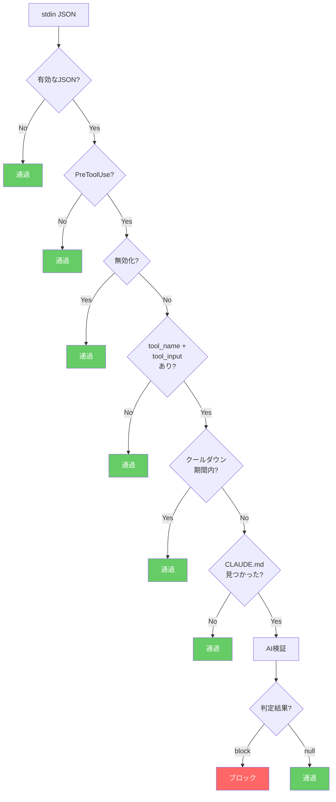

# アーキテクチャ

## 概要

claudemd-guard v2 は Claude Code の PreToolUse フックとして動作する TypeScript アプリケーション。
`Edit`/`Write`/`Bash` ツール実行前に発火し、CLAUDE.md のルールに対して AI 検証を行い、違反操作をブロックする。

## フック動作フロー



## モジュール構成



## CLAUDE.md 収集ロジック



## モデルクライアント選択



## 早期リターン条件



## 環境変数

| 変数名 | デフォルト | 説明 |
|---|---|---|
| `CLAUDEMD_GUARD_MODEL` | `claude-sonnet-4-6` | 検証モデル |
| `CLAUDEMD_GUARD_API_KEY` | — | Anthropic APIキー |
| `CLAUDEMD_GUARD_COOLDOWN` | `0` | クールダウン秒数 |
| `CLAUDEMD_GUARD_DISABLED` | `false` | 無効化フラグ |
| `USE_SYSTEM_CLAUDE` | `false` | `true`でPATH上のclaudeを強制使用（デフォルトは~/.claude/local/claude → PATHフォールバック） |

## インストール構成

```
~/.claude/settings.json
└── hooks.PreToolUse[]
    └── matcher: "Edit|Write|Bash"
        └── command: "node /path/to/claudemd-guard/dist/cli/claudemd-guard.js"
```
